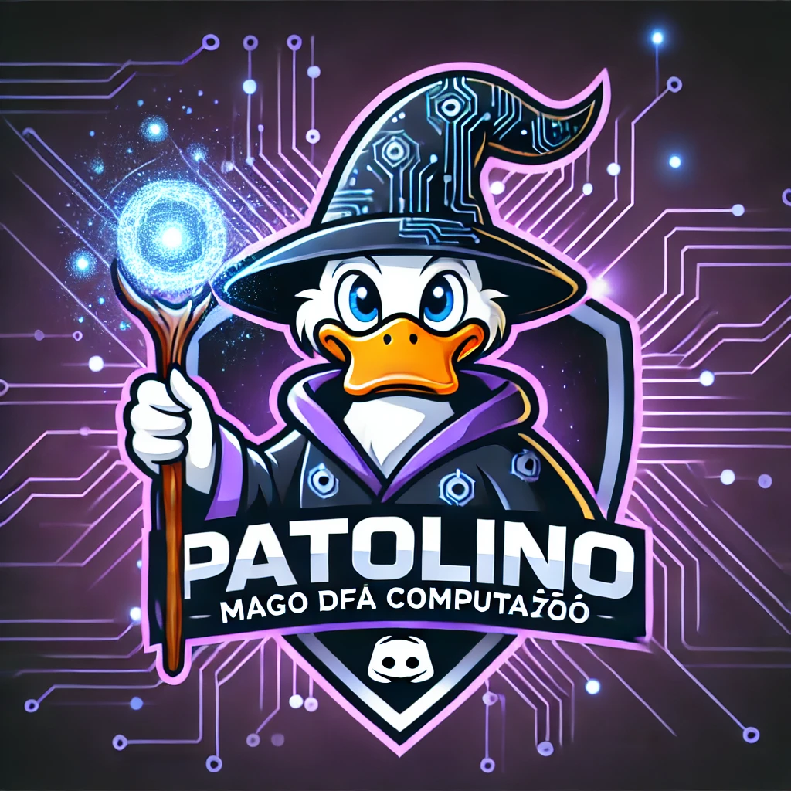

<h1 align="center">Projeto Patolino</h1>

<p align="center">
  Esse projeto foi desenvolvido nas aulas de projeto integrador da Faculdade Senac.
</p>

<p align="center">
  <a href="#sobre-o-projeto">Sobre o Projeto</a>&nbsp;&nbsp;&nbsp;|&nbsp;&nbsp;&nbsp;
  <a href="#funcionalidades">Funcionalidades</a>&nbsp;&nbsp;&nbsp;|&nbsp;&nbsp;&nbsp;
  <a href="#tecnologias-utilizadas">Tecnologias Utilizadas</a>&nbsp;&nbsp;&nbsp;|&nbsp;&nbsp;&nbsp;
  <a href="#como-executar">Como Executar</a>&nbsp;&nbsp;&nbsp;|&nbsp;&nbsp;&nbsp;
  <a href="#licença">Licença</a>
</p>

<p align="center">
  
</p>

---

## Sobre o projeto

O Projeto Patolino é um jogo de perguntas e respostas focado em Java, desenvolvido como parte do Projeto Integrador da faculdade Senac. A iniciativa partiu do desafio de aplicar, em grupo, conceitos fundamentais de desenvolvimento de software: desde programação orientada a objetos, uso de bibliotecas gráficas (Swing) até manipulação de arquivos para armazenamento de dados. O projeto proporcionou experiência real de trabalho em equipe e integração entre os membros, simulando situações do mercado de tecnologia.

## Tecnologias Utilizadas

- Java 8+
- Swing (`javax.swing`)
- Programação Orientada a Objetos (POO)
- Persistência em arquivos `.txt`
- Maven (build e dependências)

## Funcionalidades

- Quiz Temático de Java: Perguntas divididas por fases.
- Sistema de Vidas: Cada jogador tem número limitado de tentativas.
- Múltiplos Jogadores: Permite que vários usuários participem em uma mesma sessão.
- Ranking de Pontuação: Guarda e exibe a pontuação dos melhores jogadores.
- Timer para Resposta: Limite de tempo para responder cada pergunta.
- Interface Gráfica (Swing): Navegação intuitiva em janelas.
- Persistência em Arquivos: Perguntas e rankings salvos em arquivos `.txt`.
- Menu Inicial: Opções para iniciar o jogo, consultar ranking e sair.

## Como Executar

Clone o repositório:

```bash
git clone https://github.com/EricSouzaDosSantos/projeto-patolino.git## Contribuições
```
Contribuições externas são bem-vindas! Para contribuir:

1. Faça um fork deste repositório.
2. Crie uma branch para sua feature ou correção.
3. Realize o pull request detalhando as alterações.


## Colaboradores

Este projeto foi desenvolvido em colaboração com os seguintes integrantes do grupo:

- Luis Felipe
- 
- 

## Licença
Distribuído sob a Licença MIT. Consulte o arquivo LICENSE para mais informações.